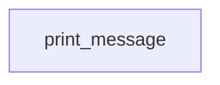

# Hello GitHub

- **DAG ID:** `hello_github`
- **Description:** A simple DAG to say hello to GitHub
- **Schedule:** @hourly
- **Catchup:** False
- **Start date:** 2025-08-25T04:00:00+00:00
- **Max active runs:** 16
- **Max active tasks:** 16
- **Tags:** example

## Details

    # Description
    This is a basic hello world dag to ensure that Airflow is working properly.
    

## Task Flow

## Tasks (1)

| Task ID | Operator | Retries | Doc |
|---|---:|---:|---|
| `print_message` | _PythonDecoratedOperator | 0 |  |

---
_This file is auto-generated. Regenerate with the project's `generate_dag_docs.py` script._